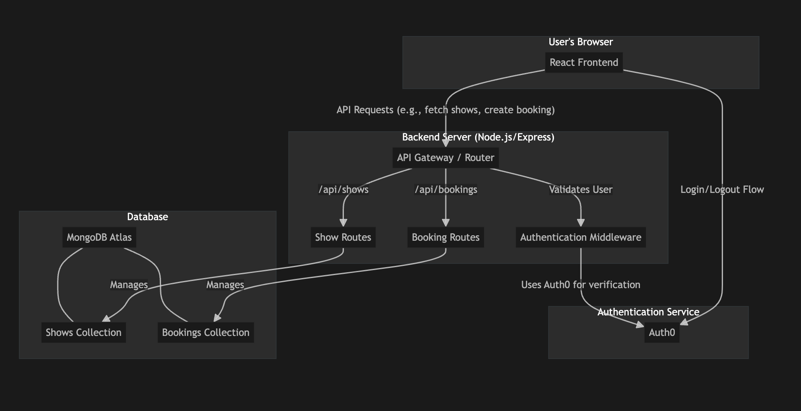

# BookYourMovie: Movie Ticket Booking System

BookYourMovie is a full-stack web application that allows users to browse movies, view showtimes, and book seats. It features a modern, responsive user interface and a robust backend to manage movie data and user bookings. The application is built using the MERN stack and integrates with Auth0 for secure user authentication.

## Features

-   **Browse Movies**: View a list of currently playing movies with posters and genres.
-   **View Show Details**: Get more information about a movie, including its description and available showtimes.
-   **Seat Selection**: An interactive seat map allows users to select one or more available seats.
-   **User Authentication**: Secure login and registration are handled by Auth0. Users must be logged in to book tickets.
-   **Personalized Experience**: The navigation bar greets users by their first name and provides a dropdown menu for accessing their bookings and logging out.
-   **My Bookings**: Users can view a list of all their past and upcoming bookings.
-   **Cancel Bookings**: Users have the option to cancel their bookings.
-   **Dynamic Seat Availability**: The available seat count is calculated in real-time and displayed for each showtime.

## Tech Stack & Architecture

The application is built on the **MERN stack**, a popular and powerful combination of technologies for creating full-stack web applications.

-   **MongoDB**: A NoSQL database for storing all application data, including movie shows and user bookings.
-   **Express.js**: A backend web application framework for Node.js, used to build the RESTful API that the frontend communicates with.
-   **React**: A JavaScript library for building the user interface, allowing for a dynamic and responsive single-page application (SPA).
-   **Node.js**: A JavaScript runtime environment that executes the backend server code.

For user authentication, the application integrates with **Auth0**, a third-party service that handles user login, sign-up, and security.

### Architecture Diagram




### Frontend (Client-Side)

The frontend is what the user sees and interacts with in their browser. It was built using React and a rich ecosystem of libraries to create a modern, interactive experience.

-   **Core Library: React.js**
    -   **Functionality**: Manages the UI as a collection of components. Key features used include:
        -   **Components**: The UI is broken down into reusable components like `ShowList`, `ShowDetails`, `MyBookings`, and the navigation bar in `App.jsx`.
        -   **State & Hooks**: `useState` and `useEffect` are used extensively to manage component-level state, such as the list of selected seats or the currently chosen showtime.

-   **UI Framework: Material-UI (MUI)**
    -   **Functionality**: Provides a library of pre-built, customizable React components that follow Material Design principles. This was used for:
        -   **Layout**: `Grid`, `Box`, `Container`, and `Card` for structuring the pages and movie listings.
        -   **Navigation**: `AppBar`, `Toolbar`, `Button`, `Menu`, and `MenuItem` for the main navigation bar and user dropdown.
        -   **Feedback**: `CircularProgress` for loading states, `Alert` for messages, and `Snackbar` for notifications.

-   **Routing: React Router (`react-router-dom`)**
    -   **Functionality**: Enables navigation between different views or pages within the single-page application. It maps URLs like `/`, `/show/:showId`, and `/my-bookings` to their corresponding React components.

-   **Data Fetching & Server State: React Query (`@tanstack/react-query`)**
    -   **Functionality**: Simplifies fetching, caching, and updating data from the backend. It manages loading and error states automatically and helps keep the UI in sync with the server data. For example, it's used to fetch the list of shows and the details for a specific movie.

-   **Authentication: Auth0 React SDK (`@auth0/auth0-react`)**
    -   **Functionality**: Integrates the frontend with Auth0 for secure user authentication. It provides:
        -   Hooks like `useAuth0()` to get user information (e.g., name, email) and authentication status.
        -   Methods like `loginWithRedirect()` and `logout()` to manage the login and logout processes.

-   **Build Tool: Vite**
    -   **Functionality**: A modern frontend build tool that provides a fast development server with features like Hot Module Replacement (HMR) and bundles the code for production.

### Backend (Server-Side)

The backend is the engine of the application. It handles business logic, communicates with the database, and provides data to the frontend through an API.

-   **Runtime Environment: Node.js**
    -   **Functionality**: Allows JavaScript to be run on the server, enabling a consistent language across the entire stack.

-   **Framework: Express.js**
    -   **Functionality**: A minimal and flexible Node.js framework used to create the application's RESTful API. Key aspects include:
        -   **Routing**: Defines the API endpoints (e.g., `/api/shows`, `/api/bookings`) and directs incoming requests to the correct controller logic.
        -   **Middleware**: Functions that run between the request and the response. We use middleware for:
            -   `cors`: To allow the frontend (on a different origin) to make requests to the backend.
            -   `express.json()`: To parse incoming JSON payloads in request bodies.
            -   A custom middleware to extract a unique user identifier from the `X-User-ID` request header, ensuring users can only access their own data.

-   **Database Interaction: MongoDB & Mongoose**
    -   **Functionality**:
        -   **MongoDB**: A NoSQL database that stores data in flexible, JSON-like documents. It's well-suited for the evolving needs of this application.
        -   **Mongoose**: An Object Data Modeling (ODM) library that provides a straightforward, schema-based solution to model application data. It's used to define schemas for `Show` and `Booking` and to interact with the MongoDB database.

## API Endpoints

### Shows

-   `GET /api/shows`: Get a list of all shows.
-   `GET /api/shows/:id`: Get details for a specific show.

### Bookings

-   `GET /api/bookings`: Get all bookings for the authenticated user.
-   `POST /api/bookings`: Create a new booking.
-   `POST /api/bookings/:id/cancel`: Cancel a specific booking.
-   `GET /api/bookings/show/:showId/seats`: Get all booked seats for a specific show and showtime.

## Setup and Installation

To run this project locally, you will need to have Node.js and MongoDB installed.

### 1. Clone the Repository

```bash
git clone <repository-url>
cd movie_ticket_booking_system
```

### 2. Configure Environment Variables

You will need to create two `.env` files: one for the frontend and one for the backend.

**Backend (`backend/.env`):**
```
MONGO_URI=your_mongodb_connection_string
```

**Frontend (`frontend/.env.local`):**
```
VITE_AUTH0_DOMAIN=your_auth0_domain
VITE_AUTH0_CLIENT_ID=your_auth0_client_id
VITE_AUTH0_AUDIENCE=your_auth0_audience
VITE_API_BASE_URL=http://localhost:3000/api
```
*Replace the placeholder values with your actual credentials.*

### 3. Install Dependencies

Install the necessary packages for both the frontend and backend.

**Backend:**
```bash
cd backend
npm install
```

**Frontend:**
```bash
cd ../frontend
npm install
```

### 4. Run the Application

You will need to run the frontend and backend servers in separate terminals.

**Run the Backend Server:**
```bash
# From the /backend directory
npm start
# Or using node:
node app.js
```

**Run the Frontend Development Server:**
```bash
# From the /frontend directory
npm run dev
```

The application should now be running, with the frontend accessible at `http://localhost:5173` (or another port if 5173 is busy) and the backend at `http://localhost:3000`.

## Usage

### For Users

1. **Browse Shows**: Visit the homepage to see all available movies
2. **Select a Show**: Click on any movie to view details
3. **Choose Showtime**: Select your preferred showtime from the dropdown
4. **Select Seats**: Click on available seats (green) to select them
   - Selected seats turn yellow
   - Booked seats are red
   - You can select multiple seats
5. **Login**: Click "Login to Book" to authenticate with Auth0
6. **Confirm Booking**: After login, click "Book X Seats" to confirm
7. **View Bookings**: Go to "My Bookings" to see all your reservations
8. **Cancel Bookings**: Cancel any booking from the My Bookings page

### For Developers

#### API Endpoints

- `GET /api/shows` - Get all shows
- `GET /api/shows/:id` - Get specific show
- `POST /api/bookings` - Create a booking
- `GET /api/bookings` - Get user's bookings
- `POST /api/bookings/:id/cancel` - Cancel a booking
- `GET /api/bookings/show/:showId/seats` - Get booked seats for a show

#### Database Models

- **Show**: Movie information, showtimes, available seats
- **Booking**: User bookings with seat, showtime, and status

## Current Status

✅ **Working Features:**
- Movie listing and details
- Seat selection with real-time availability
- Multiple seat booking
- Booking creation and storage
- Booking cancellation
- User authentication (Auth0)
- Protected routes

⚠️ **Temporary Implementation:**
- Using temporary user IDs instead of full Auth0 JWT integration
- Basic error handling
- Simple pricing ($10 per seat)

🔄 **Future Enhancements:**
- Full Auth0 JWT integration
- Payment processing
- Email confirmations
- Admin panel for managing shows
- Advanced seat selection (aisles, premium seats)
- Movie ratings and reviews

## Troubleshooting

### Common Issues

1. **Port already in use**
   ```bash
   # Kill processes on port 3000
   lsof -ti:3000 | xargs kill -9
   ```

2. **MongoDB connection issues**
   - Ensure MongoDB is running
   - Check connection string in backend .env

3. **Auth0 configuration**
   - Verify Auth0 domain, client ID, and audience in frontend .env
   - Check Auth0 application settings

4. **Frontend not loading**
   - Check if backend is running on port 3000
   - Verify API URL in frontend .env

### Development Commands

```bash
# Backend
cd backend
npm install
node app.js

# Frontend
cd frontend
npm install
npm run dev

# Test API
curl http://localhost:3000/api/shows
```

## Contributing

1. Fork the repository
2. Create a feature branch
3. Make your changes
4. Test thoroughly
5. Submit a pull request

## License

This project is licensed under the MIT License. 